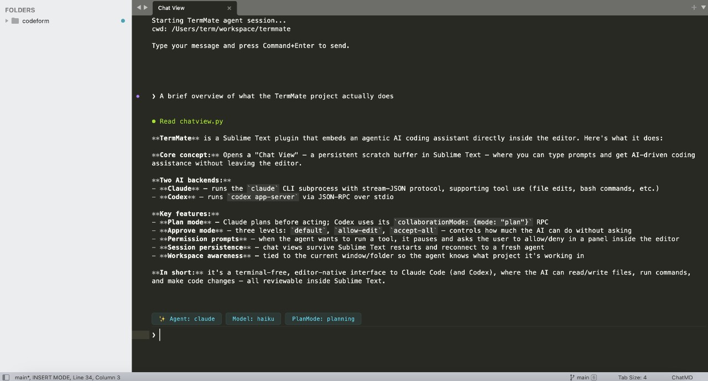

# TermMate

**Agentic Coding Mate from Mind to Code**



TermMate is a professional AI coding agent for Sublime Text that supports multi agent providers, including **Claude Code** and **Codex**. It builds a seamless agentic interface directly within your editor for autonomous task execution, codebase exploration, and smart refactoring. **TermMate Agent in your editor, not in terminal.**

For detailed usage, please refer to the [TermMate Documentation](https://termmate.app/docs/setup).

## Getting Started

### 1. Prerequisites

TermMate relies on external agent cli. Install the required CLI tools:

**Claude Code:**
```bash
curl -fsSL https://claude.ai/install.sh | bash
```

**Codex:**
```bash
npm install -g @openai/codex
```

> **Note:** TermMate automatically detects CLI installation paths across multiple environments, including **Homebrew**, **npm-global**, **Yarn**, and common local binary directories. You typically don't need to manually configure environment variables or search paths.


### 2. Authentication

Authenticate the agents via your terminal:

**Claude Code:**
```bash
claude /login
```

**Codex:**
```bash
codex login
```

### 3. TermMate Installation

Install TermMate via [Package Control](https://packagecontrol.io/packages/TermMate):

1. Open the Command Palette (`Cmd+Shift+P` on macOS, `Ctrl+Shift+P` on Windows/Linux).
2. Type `Package Control: Install Package` and press `Enter`.
3. Search for `TermMate` and press `Enter`.

### 4. Start Chat

- Open the command palette (`Cmd+Shift+P` on macOS, `Ctrl+Shift+P` on Windows/Linux).
- Type `TermMate: Start Chat` and press `Enter`.
- A new view will open for the TermMate chat.
- Type your message and press `Cmd+Enter` (macOS) or `Ctrl+Enter` (Windows/Linux) to send.
- You can stop a running conversation at any time. Use the shortcut `Cmd+Escape` (Mac) / `Shift+Escape` (Windows/Linux) in the chat window, or run `TermMate: Stop Conversation` from the command palette.

## Usage & Key Features

**Quick Prompt Without Chat View**

Use the command palette (`TermMate: Prompt`) to send a quick instruction to the agent without opening the chat view manually.

**Clear Session**

To reset the current conversation history and start a completely fresh context, open the command palette and run **`TermMate: Clear Session`**. This will reload the agent and clear its memory for the current workspace.

**Set Working Directory**

Right-click on any folder in the sidebar and select **Set Working Directory** to set the working directory for the agent. This affects the current working directory when agents execute commands or access files. You can also use the command palette.

**Chat with Current File or Selection**

You can right-click in any file, tab, and select **Chat with Agent**. This will:

- Open the TermMate chat view (if not already open).
- Insert a reference to the file (`@filename`) or selected line range (`@filename#L1-10`) into the message prompt.
- Tagged files will be automatically sent as context to the active agent.

**Smart Completion**

Type `@` in the chat view for real-time suggestions of files and workspace symbols.

### Advanced Control (Pro Features)

TermMate provides deep integration with agentic workflows via the Command Palette:

**Plan Mode**

Toggle between **Fast** (direct execution) and **Planning** (deliberative reasoning) via `TermMate: Plan Mode`.

**Approve Mode**

Agents perform various actions (tools) like reading files, searching the web, or executing commands. You can control how much manual approval is required via the command palette: `TermMate: Approve Mode`

- **Default**: Prompts for your approval by default.
- **Allow Edit**: Automatically approves "safe" read/edit operations; still prompts for "risky" commands.
- **Accept All**: Automatically approves all tool calls, including shell command execution for maximum autonomy.

**Switch Agents & Model Selection**

Effortlessly swap between Claude, Codex, or custom agent providers. Fine-tune performance by selecting specific LLM models for different tasks.

## Shortcuts & Commands

| Action | macOS | Windows/Linux | Command Palette |
| :--- | :--- | :--- | :--- |
| **Start New Chat** | - | - | `TermMate: Start Chat` |
| **Send Message** | `Cmd+Enter` | `Ctrl+Enter` | - |
| **Stop Conversation** | `Cmd+Escape` | `Shift+Escape` | `TermMate: Stop Conversation` |
| **Navigate Input History** | `Up` / `Down` | `Up` / `Down` | - |
| **Mention File** | `@` | `@` | - |
| **Set Workspace** | - | - | `TermMate: Set Working Directory` |
| **Switch Mode** | - | - | `TermMate: Plan Mode` |
| **Approve Mode** | - | - | `TermMate: Approve Mode` |

## Configuration

Customize TermMate by editing your settings: `Preferences -> Package Settings -> TermMate -> Settings`

### Agent CLI Paths

While TermMate automatically detects most agent CLI installation paths, you may need to configure them manually if:

- You use a custom installation location not listed in the default paths.
- You have multiple versions installed and want to pin a specific binary.
- Automatic detection fails on your specific OS configuration.

```json
{
    "claude_command": "/path/to/your/custom/claude",
    "codex_command": "/path/to/your/custom/codex"
}
```

### Custom Environment Variables

The `env` configuration allows you to inject custom environment variables directly into the process when starting an agent CLI command. This is useful for providing API keys, custom base URLs, or passing specific environment values without altering your global system configuration.

For example, to configure **OpenRouter** for Claude, you can provide your OpenRouter API key and base URL in the `env` section of your settings(ANTHROPIC_API_KEY should be empty in the case):

```json
{
    "env": {
        "ANTHROPIC_BASE_URL": "https://openrouter.ai/api/v1",
        "ANTHROPIC_AUTH_TOKEN": "sk-openrouter-token",
        "ANTHROPIC_API_KEY": ""
    }
}
```

### Custom Keybindings

By default, TermMate does not register a shortcut for `TermMate: Start Chat` to avoid conflicts. You can manually add a shortcut (like `Cmd+Alt+G` or `Ctrl+Alt+G`) by navigating to `Preferences -> Key Bindings` and adding the following configuration:

```json
[
    {
        "keys": ["primary+alt+g"],
        "command": "term_chat_cli",
        "args": {},
        "context":
        [
            { "key": "setting.is_widget", "operand": false }
        ]
    }
]
```

If you prefer using just the `Escape` key to interrupt the conversation when the chat view is focused, you can add this:

```json
[
    {
        "keys": ["escape"],
        "command": "term_chat_interrupt",
        "context":
        [
            { "key": "setting.chatview_chat", "operator": "equal", "operand": true }
        ]
    }
]
```

## 💡 TermMate Agent Tips

- **Selection as Context**: Select code before starting a chat to focus the agent's attention on specific logic.
- **Iterative Refinement**: Use **Planning Mode** for large architectural changes to see the agent's proposed steps before they are applied.

## Privacy & Data Handling

**TermMate does not send your entire workspace or file contents to any external servers.**

Your data will only be sent to the respective LLM services (Claude Code or Codex) under the following specific conditions:

**What data is sent:**

- Any text you manually type into the TermMate ChatView.
- The contents of specific files you explicitly tag using the `@filename` syntax.
- The outputs of shell commands, directory listings, or file contents that the agent explicitly requests to read.

**How TermMate interacts with Agents:**

- **Local Execution**: The core plugin logic runs entirely on your local machine. All communication happens locally via the official CLI tools (`claude` or `codex`) installed on your system.
- **No Data Collection**: TermMate does not collect, store, or transmit any of your source code or usage telemetry to our servers. TermMate does not send data to any third-party middleman servers; data goes directly to Anthropic or OpenAI using your own configured authentication credentials.
- Data is only sent when you actively hit command+enter(or ctrl+enter) in the ChatView, or when the agent executes a tool (if you have granted permission via your `Approve Mode` settings).


## License

TermMate is provided under the **Apache License, Version 2.0** with the **Commons Clause** condition.

This means it's free to use, modify, and redistribute the code for personal or internal use. However, **commercial resale or providing a paid service is strictly prohibited**.

For complete details, please see the [LICENSE](LICENSE) file.

